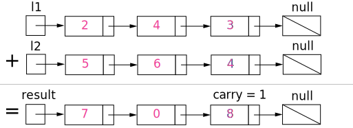

# 002-两数相加

### 题目

给出两个 **非空** 的链表用来表示两个非负的整数。其中，它们各自的位数是按照 **逆序** 的方式存储的，并且它们的每个节点只能存储 一位 数字。

如果，我们将这两个数相加起来，则会返回一个新的链表来表示它们的和。

您可以假设除了数字 0 之外，这两个数都不会以 0 开头。

**示例：**

```
输入：(2 -> 4 -> 3) + (5 -> 6 -> 4)
输出：7 -> 0 -> 8
原因：342 + 465 = 807
```

### 思路

我们使用变量来跟踪进位，并从包含最低有效位的表头开始模拟逐位相加的过程。



<center>图 1 对两数相加方法的可视化，每个结点都包含一个数字，并且数字按位逆序存储。</center>

就像你在纸上计算两个数字的和那样，我们首先从最低有效位也就是列表 $l1$ 和 $l2$ 的表头开始相加。由于每位数字都应当处于 $0 \ldots 9$ 的范围内，我们计算两个数字的和时可能会出现“溢出”。例如，$5 + 7 = 12$。在这种情况下，我们会将当前位的数值设置为 $2$，并将进位 $carry = 1$ 带入下一次迭代。进位 $carry$ 必定是 $0$ 或 $1$，这是因为两个数字相加（考虑到进位）可能出现的最大和为 $9 + 9 + 1 = 19$。

**我的解答:**

```python
def addTwoNumbers(self, l1: ListNode, l2: ListNode) -> ListNode:
        head = ListNode(0)
        p = head
        carry = 0
        while l1 or l2:
            if l1 and l2: # l1 和 l2 都不为空
                num = l1.val + l2.val + carry
                p.next = ListNode(num % 10)
                p = p.next
                carry = num // 10
                l1 = l1.next
                l2 = l2.next
            elif l1: # l2 为空
                num = l1.val + carry
                p.next = ListNode(num % 10)
                p = p.next
                temp = num // 10
                l1 = l1.next
            else: # l1 为空
                num = l2.val + carry
                p.next = ListNode(num % 10)
                p = p.next
                temp = num // 10
                l2 = l2.next
        if carry != 0: # 处理最后可能出现的进位
            p.next = ListNode(carry)
        return head.next
```

